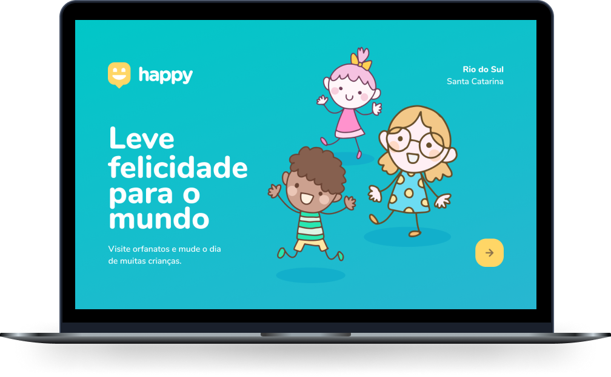

  

 

Projeto desenvolvido no evento Next Level Week #3 ministrado pela <a href="https://github.com/rocketseat">@Rocketseat</a>

 

<h2> O que é a NLW?</h2>
 
A NLW (<strong>Next Level Week #3</strong>) foi um evento realizado no ano de 2020 entre os dias 12/10 a 16/10, promovido pela <a href="https://www.youtube.com/rocketseat">Rocketseat</a> para iniciantes na programação (trilha <strong>Starter</strong>) e para desenvolvedores com mais experiência (trilha <strong>Booster</strong>).

<h3>🚀 Tecnologias</h3>
<ul>
  <li>HTML 5</li>
  <li>JavaScript</li>
  <li>CSS 3</li>
</ul>

<h4>Optei por desenvolver apenas o front-end que é meu foco por enquanto.</h4>

 
 <h2>💛 Happy</h2>
 
O projeto da NLW#3 Starter foi um site onde pessoas poderiam cadastrar orfanatos ou procurar por orfanatos disponíveis na região pesquisada.

  
 
 <h2>💻 Layout</h2>
 
Você pode acessar o layout em: <a href="https://www.figma.com/file/c01m3V45BVqvrbJur2EOvM/Happy-Web/duplicate">Happy</a>

